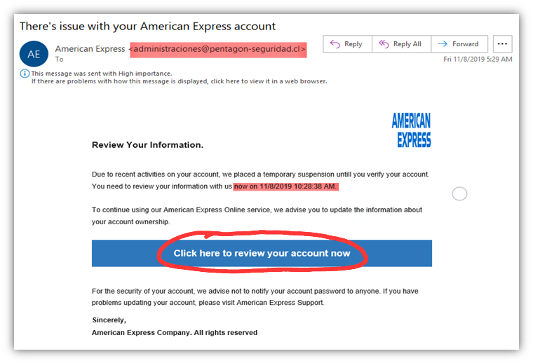

# Threat Analysis Report: Fake American Express Alert

*Figure 1: Example phishing email impersonating American Express.*

---

## Summary
This email impersonates American Express using urgency and a suspicious call to action to pressure the recipient into clicking a link that is likely intended to steal credentials.

## Attack Vector
A blue “review your account” button that likely redirects to a fake login or credential harvesting page.

## Red Flags
1. The sender address, `administraciones@pentagon-seguridad.cl`, does not match American Express.
2. The message uses urgent language to pressure the user into acting quickly.
3. The call to action button encourages the user to click without verifying the destination.
4. The email contains grammar and formatting issues that reduce credibility.

## What Failed
- Sender reputation does not match the brand being impersonated.
- The message relies on urgency and fear rather than legitimate account communication.
- The email contains wording and formatting issues that are inconsistent with a professional financial institution.

## Indicators of Compromise
- Suspicious sender domain: `pentagon-seguridad.cl`
- Brand impersonation: American Express
- Phishing style urgency
- Potential malicious link behind the button

## Detection Ideas

- SPF, DKIM and DMARC validation
- Email gateway sender reputation checks
- Lookalike domain detection
- URL scanning and sandboxing
- User reporting and security awareness monitoring

## Mitigation
- Train staff to inspect sender domains carefully
- Hover over links before clicking
- Use MFA to reduce the impact of stolen credentials
- Report suspicious emails to security teams
- Block impersonation domains at the mail gateway

## Key Takeaways
Phishing emails often succeed by combining urgency with brand impersonation. Careful inspection of the sender domain and link destination is often enough to reveal the attack.
I learned new detentions ideas mentioned above - SPF, DKIM and DMARC validation 